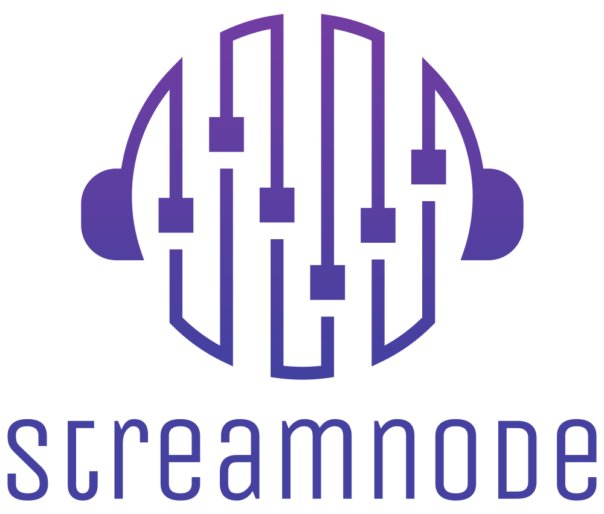
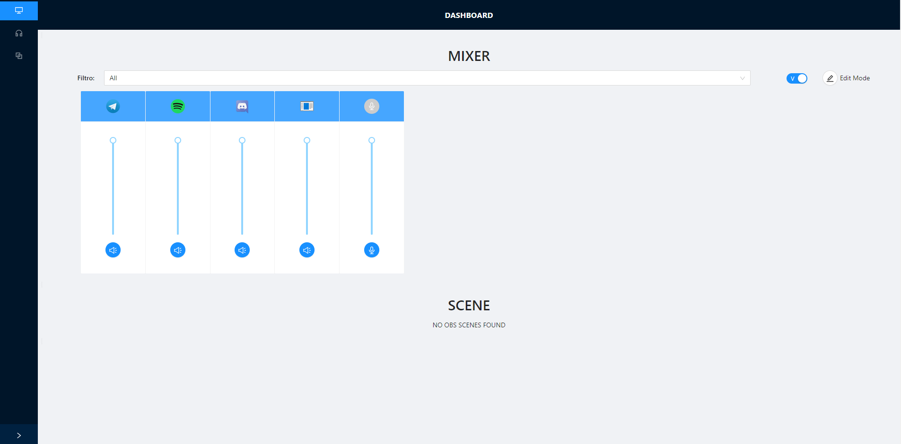

<!-- markdownlint-disable -->
<p align="center">
  
</p>

# StreamNode


[](https://github.com/Naereen/badges/)  

## 📖 Description

StreamNode is an usefull tool created to simplify the control of OBS and audio mixers, all in one web application available for smartphone, tablet and pc.

A work in progress tool used to remote control Windows Audio source and OBS.  


## 💊 Features
- Handle Volumes in Web App
- Change OBS Scenes in Web App
- Desktop App to Run or Stop the Server
- Avaible on smartphone, tablet and PC
- Change Server Settings

## 💻 Technologies
Built with  
```
- Backend: C# with NAudio and OBSWebsocketDotNet Library
- Frontend: Preact JS and Ant Design
```

## ❗ Requirements
Requirements

## ✔️ Preview 
<p align="center">
  
</p>

## 💡 Idea by

<!-- markdownlint-disable -->
<table>
  <tr>
    <td align="center">
        <a href="https://github.com/lucalas">
            
            <br />
            <sub>
                <b>Luca Taddeo</b>
            </sub>
        </a>
        <br />
        <a href="#" title="Ideas, Planning, & Feedback">
            🤔
        </a>
        <a href="#" title="Code">
            💻
        </a>
        <a href="#" title="Reviewed Pull Requests">
            👀
        </a> 
        <a href="#" title="Documentation">
            📖
        </a>
        <a href="#" title="Bug Reports">
            🐛
        </a> 
        <a href="#" title="Maintenance">
            🚧
        </a>
    </td>
</table>

## ✨ Contributors
Thanks goes to these wonderful people ([emoji key](https://allcontributors.org/docs/en/emoji-key)):
<!-- markdownlint-disable -->
<table>
  <tr>
    <td align="center">
        <a href="https://github.com/saliougaye">
            
            <br />
            <sub>
                <b>Saliou Gaye</b>
            </sub>
        </a>
        <br />
        <a href="#" title="Code">
            💻
        </a>
        <a href="#" title="User Testing">
            📓
        </a> 
        <a href="#" title="Documentation">
            📖
        </a>
        <a href="#" title="Bug Reports">
            🐛
        </a>
        <a href="#" title="Design">
            🎨
        </a>  
    </td>
    <td align="center">
        <a href="https://github.com/peppepol">
            
            <br />
            <sub>
                <b>Peppe Polistena</b>
            </sub>
        </a>
        <br />
        <a href="#" title="Design">
            🎨
        </a>
        <a href="#" title="Code">
            💻
        </a>
        <a href="#" title="User Testing">
            📓
        </a>
        <a href="#" title="Bug Reports">
            🐛
        </a>
    </td>
   
  </tr>
</table>

This project follows the [all-contributors](https://github.com/all-contributors/all-contributors) specification. Contributions of any kind welcome!

## Support this Project
___
If this project has helped you in any way, a small contribution is welcome!